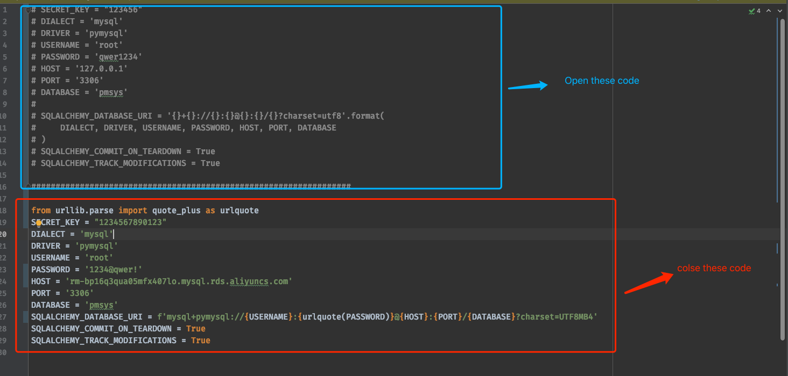

# COMP9323 Project - Online Project Proposal Management
## 1. How to view source code

Simply open the source code folder. Two folders named "comp9323-backend" and "comp9323-frontend" are to store all the source code.

## 2. Where are the main classes

### comp9323-backend

#### API connections routes reside in

```
comp9323-backend/app/login/__init__.py
```

#### Detailed implementation for each route are located in folder

```
comp9323-backend/app/login
```

There are multiple files respecting to different area of our backend.

#### Models of our database

The file declaring different tables in our mysql server is located in 

```
comp9323-backend/app/models.py
```

### comp9323-frontend

#### The main excutable is in

```
main.js
```

This file contains code for the frontend server.

#### React shared componenets are in 

```
comp9323-frontend/components
```

These components are used across different pages in the system.

#### React code for individual pages are located in 

```
comp9323-frontend/pages
```

where different areas of react pages are organised in different folders. Individual pages are in these folders.

#### MISC

Some uploaded static images are located in

```
comp9323-frontend/static
```
------------

## 3. Environment prepare
Mac / windows 10 / lubuntu 20.4.1
## version
### Mysql
Mysql version is 8.0.19 or 8.0.23\
mysql user is "root"\
mysql password is "1234"\
Mysql download link: https://dev.mysql.com/downloads/
### Python3
Python3 version is 3.8 or 3.9
### nodejs
node version is 16.16.0\
node download link: https://nodejs.org/en/download/

## Backend setting
### install requirement
in /comp9323-backend run
```shell
pip3 install -r requirement.txt
```
**This project connect aliyun cloud mysql**
------------
### if you want connect local mysql please do steps as follow:
**step1: creat a database named pmsys**
```shell
mysql -u root -p
```
enter the password is "qwer1234"\
**step2: create database**
in the mysql enter:
```shell
create database pmsys
```
**step3: change config.py**
in /comp9323-backend/config.py

**step3:Under folder /iMovie_backend run**
```shell
flask db migrate
flask db upgrade
```
**step4:insert data**
```shell
python3 insert_data.py
```
------------

### run server
```shell
python3 app.py runserver
```


## Frontend setting
1. check install: node v16.15.0
```bash
node -v
```
2. install package.json
```bash
npm config set registry https://registry.npmjs.org
npm install
```
3 run the development server:
```bash
npm run dev
```
## webLink
http://localhost:8088/Dashboard/CourseOverview
